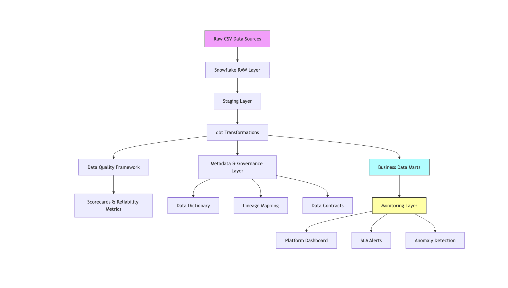
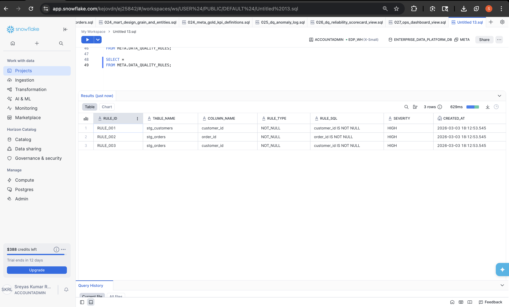

# Enterprise Data Quality & Governance Platform



Snowflake • dbt • Data Quality • Metadata Governance • Data Reliability

---

# Overview

This project demonstrates a **modern enterprise data platform architecture** built on **Snowflake and dbt** with integrated **data quality monitoring, metadata governance, lineage tracking, and reliability monitoring**.

The platform simulates how organizations build **trusted data systems** where data pipelines are governed, monitored, and validated to ensure reliable analytics.

The design follows a **layered architecture used in modern enterprise data platforms**.

---

# 🚀 Platform Demo (End-to-End Execution)

The platform can be executed end-to-end using the provided SQL scripts.

This demonstrates how enterprise data teams orchestrate **data ingestion, transformation, validation, governance, and monitoring**.

---

## Step 1 — Create Platform Infrastructure

Run the platform setup script:

```sql
sql_platform/01_platform_setup/001_create_platform.sql
```

This creates:

- Snowflake database
- platform schemas
- base infrastructure

Schemas created:

- RAW
- STAGING
- DBT_SREYASLANKALA
- DQ
- META
- OPS

---

## Step 2 — Create RAW Data Layer

Execute:

```sql
sql_platform/02_raw_layer/004_create_raw_tables.sql
sql_platform/02_raw_layer/005_load_raw_data.sql
```

This loads source datasets into the **RAW schema**.

Example datasets:

- customers
- orders
- order_items
- payments

---

## Step 3 — Run STAGING Transformations

Execute:

```sql
sql_platform/03_staging_layer/006_stg_customers_validation.sql
```

This prepares standardized datasets for transformation.

The staging layer performs:

- data cleansing
- column standardization
- schema normalization

---

## Step 4 — Execute dbt Transformation Models

Run dbt transformations:

```bash
cd edp_dbt
dbt run
```

This generates analytics-ready datasets used for reporting and monitoring.

---

## Step 5 — Run Data Quality Framework

Execute:

```sql
sql_platform/04_data_quality/007_data_quality_validation.sql
sql_platform/04_data_quality/036_data_quality_rule_engine.sql
sql_platform/04_data_quality/043_metadata_driven_dq_rule_engine.sql
```

This runs automated validation rules and logs failures.

---

## Step 6 — Populate Metadata Governance Layer

Execute scripts in:

```
sql_platform/05_metadata/
```

This builds governance components including:

- data dictionary
- data ownership
- lineage mapping
- data contracts
- SLA tracking

---

## Step 7 — Run Monitoring Layer

Execute monitoring views:

```
sql_platform/07_monitoring/
```

This produces operational dashboards and reliability metrics.

---

## Optional — Execute Full Platform

Run the orchestration script:

```sql
sql_platform/000_run_full_platform.sql
```

This simulates **enterprise pipeline execution**.

Execution flow:

```
RAW → STAGING → dbt → Data Quality → Metadata Governance → Monitoring
```

---

# Architecture Overview

The platform follows a **layered enterprise architecture**.

```
Source Data
    ↓
RAW Layer
    ↓
STAGING Layer
    ↓
dbt Transformations
    ↓
Analytics / Data Marts
```

Supporting platform layers:

```
Data Quality Framework
Metadata Governance
Reliability Monitoring
```

---

# Platform Schemas

The platform is organized into logical schemas representing each layer.

| Schema | Purpose |
|------|------|
| RAW | Raw ingestion layer |
| STAGING | Transformation preparation |
| DBT_SREYASLANKALA | dbt analytical models |
| DQ | Data quality monitoring framework |
| META | Metadata governance |
| OPS | Platform monitoring |

---

# Data Ingestion Layer

Source datasets are loaded into the **RAW schema** without transformation.


Example datasets:

- customers
- orders
- order items
- payments

---

# Transformation Layer

Data is standardized and prepared in the **STAGING schema**.


This layer performs:

- schema normalization
- field standardization
- data preparation for analytics

---

# dbt Transformation Models

dbt models generate analytics-ready datasets.


Example models:

- customer metrics
- order aggregates
- retention KPIs
- anomaly detection datasets

dbt provides:

- modular SQL transformations
- dependency management
- pipeline reproducibility

---

# Data Quality Framework

The platform includes a **dedicated data quality validation framework**.


Components include:

- rule execution engine
- exception tracking
- anomaly logging
- validation result storage

---

# Metadata Driven Data Quality Rules

The platform implements a **metadata-driven data quality rule engine**.

Rules are stored in governance tables and dynamically executed against datasets.

Example rules:

- NOT NULL validation
- duplicate detection
- business rule checks



---

# Data Quality Scorecards

Automated **data reliability scorecards** monitor platform health.


Metrics tracked:

- tests executed
- failed tests
- row-level failures
- exception counts
- pipeline run status

---

# Metadata Governance Layer

The **META schema** manages governance and documentation.


Governance features:

- data dictionary
- lineage mapping
- data ownership
- data contracts
- SLA definitions

---

# Platform Monitoring

Operational monitoring is implemented through the **OPS schema**.


Monitoring features include:

- pipeline health
- SLA tracking
- anomaly detection
- reliability metrics

---

# Platform Object Distribution

The following query summarizes platform objects across layers.


This illustrates how ingestion, transformation, governance, and monitoring components are structured.

---

# Data Lineage Example

Example lineage across the platform:

```
RAW_CUSTOMERS
      ↓
STAGING_CUSTOMERS
      ↓
DBT_CUSTOMER_METRICS
      ↓
DQ_SCORECARD
      ↓
OPS_MONITORING_VIEWS
```

Lineage tracking enables:

- data traceability
- root cause analysis
- governance enforcement

---

# Platform Capabilities

The platform demonstrates capabilities used in enterprise data systems.

| Capability | Implementation |
|------|------|
| Data Ingestion | RAW schema |
| Data Transformation | dbt models |
| Data Quality Validation | SQL rule engine |
| Metadata Governance | META schema |
| Data Dictionary | governance tables |
| Data Lineage | lineage mapping |
| Data Contracts | metadata validation |
| Reliability Monitoring | OPS schema views |
| SLA Monitoring | alert views |
| Anomaly Detection | monitoring queries |

---

# Technology Stack

| Technology | Purpose |
|------|------|
| Snowflake | Data warehouse |
| dbt | Data transformations |
| SQL | Data modeling |
| GitHub | Version control |
| Data Quality Framework | Validation and monitoring |

---

# Repository Structure

```
enterprise-data-platform
│
├── architecture
│   ├── enterprise_data_platform_architecture.png
│   └── platform_architecture.mmd
│
├── docs
│   └── governance_framework.md
│
├── edp_dbt
│   ├── models
│   ├── macros
│   ├── tests
│   └── dbt_project.yml
│
├── sql_platform
│   └── 000_run_full_platform.sql
│
├── screenshots
│   ├── 01_raw_layer_tables.png
│   ├── 02_staging_layer_tables.png
│   ├── 03_dbt_models.png
│   ├── 04_dq_tables.png
│   ├── 05_dq_scorecard_results.png
│   ├── 06_metadata_tables.png
│   ├── 07_ops_monitoring_views.png
│   └── 08_platform_layer_summary.png
│
└── README.md
```

---

# Future Enhancements

Potential improvements include:

- integration with enterprise data catalogs (Collibra / Alation)
- automated lineage visualization
- CI/CD pipeline testing
- data observability dashboards
- automated SLA alerting

---

# Author

Sreyas Lankala  

Data Quality • Governance • Metadata • Data Reliability  

LinkedIn  
https://www.linkedin.com/in/sreyas-lankala/

GitHub  
https://github.com/sreyas-lankala